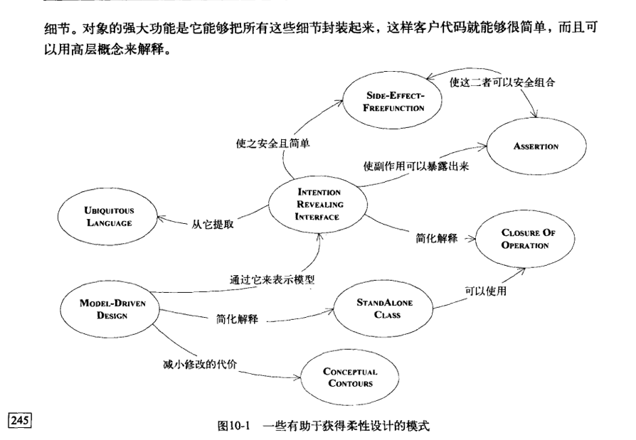

### DDD笔记及参考资料
~~~~~~~~~
https://developer.aliyun.com/article/719251

MODEL-DRIVEN DESIGN(模型驱动设计) 不再将分析模型合程序设计分离开，而是寻求一种能够满足这两方面的单一模型。
基本要素:

1、模型要支持有效的实现
2、抽象出关键的领域知识
~~~~~~~~~
第四章、分离领域

1、模型驱动设计的基本原理

Entity: 表示某种具有连续性和标识的事物

Value Object:事物的某种状态属性

Service: 领域中适合用动作或者操作的表示

2、分层架构

第五章、软件中所表示的模型

5.1 关联

仔细的简化和约束模型的关联是通往Model-Driven Design的必经之路。
通过类作用域的方式来简化和约束模型的关联
三种使得关联更易于控制:
1) 规定一个遍历方向
2) 添加一个限定符，以便有效地减少多重关联
3) 消除不必要的关联

5.2 模式: Entity (Reference Object)

5.3 模式: Value Object

5.4 模式: Service
好的service有以下3个特征:
1) 与领域概念相关的操作不是Entity或Value Object 的一个自然的部分
2) 接口是根据领域模型的其他元素定义的
3) 操作是无状态的。

当领域中的某个重要的过程或转换操作不属于实体或值对象的自然职责时，应该在模型中添加一个作为独立接口的操作，并将其声明为Service。

5.5 模式: Module(也称为Package)

对外低耦合，对内高内聚

5.6 建模范式
主流的范式是面向对象设计

第六章、领域对象的生命周期

6.1 模式: Aggregate

6.2 模式: Factory

https://tech.meituan.com/2017/12/22/ddd-in-practice.html

第十章 柔性设计
设计必须让人们乐于使用，而且易于做出修改，这就是柔性设计（supple design）;

intention-revealing interface (释意接口)
side-effect-free function 副作用
assertion 断言
conceptual contour 概念轮廓
standalone class 孤立的类 尽力把复杂的计算提取到孤立的类中，可能实现此目的的一种方法是把具有紧密联系的类中所含有的Value Object建模出来
closure of operation 闭合操作 

声明式设计

